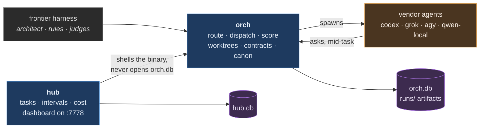
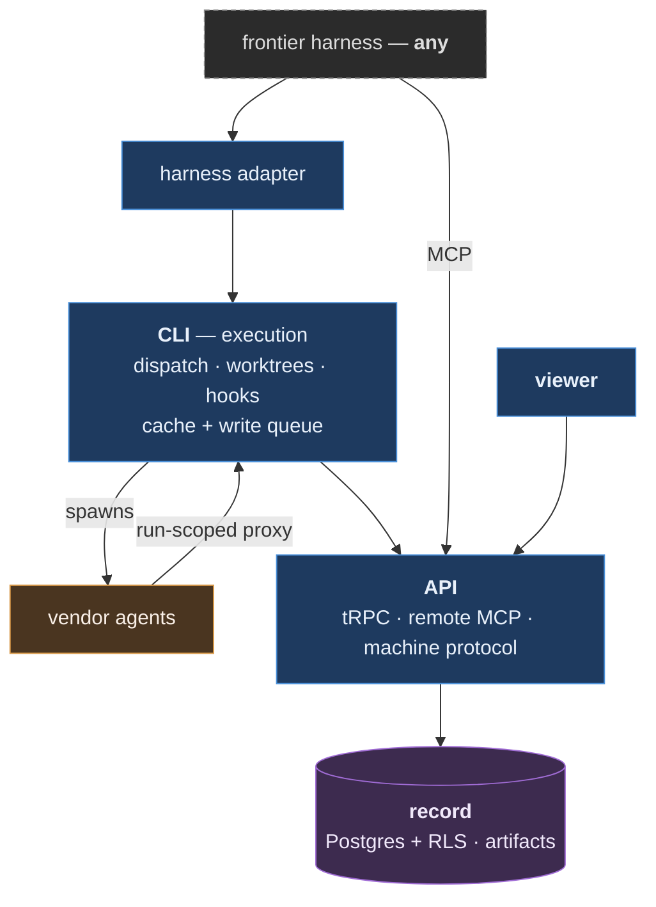

# Bottega

A workshop. One designer holds the whole picture, several hands build to that
design, and nothing ships the designer has not read and signed.

Bottega is orchestration that sits **below** a frontier harness, not in place of
one. The architect designs, rules and judges in the harness. Bottega routes the
building to external agents on flat-rate subscriptions and local models, scores
what comes back, and sends the next job to whichever agent has earned it.

The delegation costs nothing in judgement because workers are forbidden to make
decisions: a worker reaching a judgement call stops and asks, and fidelity is a
scored axis so deviation is measured rather than trusted. See `AGENTS.md` for
the reasoning.

## Today

Everything runs on one machine.

`hub` reaching `orch` through its binary rather than its database is deliberate.
A database shared between two concerns is how two concerns quietly become one.

| concern | what it is |
|---|---|
| `orchestrator/` | Route work to external agents, score them per job, route the next job by the evidence. Its own canon. |
| `hub/` | Every project's work in one view: what is in flight, what it cost, the daily report. Its own canon. |
| `ops/` | The machine itself: refresh, launchd, brew upkeep. |
| `local-stack/` | Serving models locally, and the local model host. |
| `shared/` | The only code any two concerns may both import. |

Concerns do not reach into each other. `bun run check` enforces it, because a
boundary nobody checks has already drifted.

## Where this is going

**Not built.** The target is a hosted record with one local agent per machine.
Everything that touches a disk stays local; every fact worth keeping moves to a
multi-tenant record that a team, a second machine, or a different harness can
reach.

Three properties the picture exists to fix: the harness on top is swappable, the
record is reached only through the API and never by opening a database, and a
worker's only credential is a run-scoped proxy — it never holds a tenant token.

The plan, its evidence and its open rulings:
`orch doc show hosting-architecture --scope project --subject bottega`

## Getting started

    git config core.hooksPath .githooks   # once per clone
    cp .mcp.json.example .mcp.json        # then configure this checkout's MCP servers
    bun run check                          # tests, typecheck, boundaries, brand, canon

Keep checkout-rooted permission rules in `.claude/settings.local.json`. Absolute
checkout paths are machine-specific, while `.claude/settings.json` is shared by
every contributor.

Work is tracked in hub, and every task carries a `DEV-` key:

    ./bin/hub task list --project bottega
    ./bin/hub task new --project bottega --title "..."

Branches and commit subjects cite the key, and `orch do` requires `--key`.
