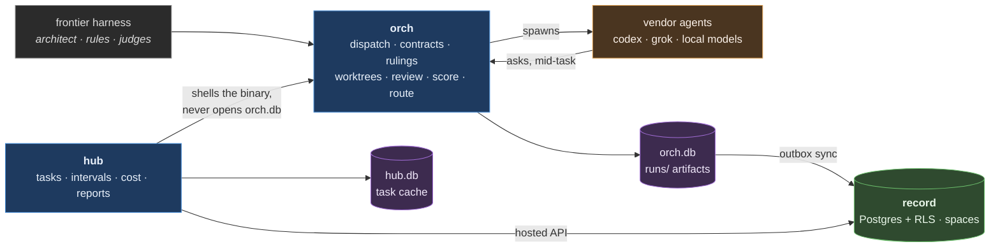

# Bottega

A workshop. One designer holds the whole picture, several hands build to that
design, and nothing ships the designer has not read and signed.

Bottega runs coding agents under a project's rules. The architect designs,
rules and judges in a frontier harness; Bottega dispatches the building to
external agents on flat-rate subscriptions and local models, each in its own
disposable worktree, under a contract that forbids the worker to decide
anything. A worker reaching a judgment call stops and asks, and the architect's
ruling resumes the same worker in the same tree. Every result is reviewed and
scored, and fidelity is a scored axis, so deviation is measured rather than
trusted. The scores then route the next job to whichever agent has earned it.
See `AGENTS.md` for the reasoning.

## Today

Execution is local. The record of what happened is hosted.

Everything that touches a disk stays on the machine: worktrees, worker
processes, the gate, run artifacts. Evidence such as runs, verdicts, reviews and
landings is written locally first and reaches the hosted record through an
idempotent outbox, so an unreachable record never stops dispatch or scoring.
Shared state such as tasks and the doc store is written through the hosted
service, with the local store as a read cache; such a write is refused, never
queued, while the service is unreachable. The record is multi-tenant: each
project belongs to one space, set by `settings.space` in the project register.

`hub` reaching `orch` through its binary rather than its database is deliberate.
A database shared between two concerns is how two concerns quietly become one.

| concern | what it is |
|---|---|
| `orchestrator/` | Dispatch work to external agents under contracts, carry rulings, review and score the results, and route the next job by the evidence. Its own canon. |
| `hub/` | Every project's work in one view: what is in flight, what it cost, and scheduled report subscriptions. Its own canon. |
| `ops/` | The machine itself: refresh, launchd, brew upkeep. |
| `local-stack/` | Serving models locally, and the local model host. |
| `retrieval/` | Embedding and rerank clients, chunking, and the benchmark that measures how often agents find the right source or doc. |
| `shared/` | The only code any two concerns may both import, including the hosted record schema. |

Concerns do not reach into each other. `bun run check` enforces it, because a
boundary nobody checks has already drifted.

## Where this is going

Bottega is being made usable by any developer: under any leading harness, on
macOS or Linux, with the human able to take the deciding role, and working out
of the box with no tracker and no hosted record. The epic plan, its decisions
and its order:

    ./bin/hub task doc show 22

The hosting design and its rulings:
`orch doc show hosting-architecture --scope project --subject bottega`

## Getting started

Install the binary, run `bottega setup`, probe an agent, create a task and
delegate it: [docs/getting-started.md](docs/getting-started.md) walks a fresh
machine to a first delegated change.

## Working on Bottega

    git config core.hooksPath .githooks   # once per clone
    cp .mcp.json.example .mcp.json        # then configure this checkout's MCP servers
    bun run check                          # tests, typecheck, boundaries, brand, canon

Keep checkout-rooted permission rules in `.claude/settings.local.json`. Absolute
checkout paths are machine-specific, while `.claude/settings.json` is shared by
every contributor.

Work is tracked in hub, and every task carries a `DEV-` key:

    ./bin/hub task list --project bottega
    ./bin/hub task new --project bottega --title "..."

Branches and commit subjects cite the key, and `orch do` requires `--key`.
