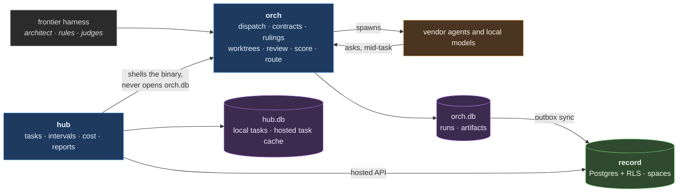

# Bottega

A workshop. One designer holds the whole picture, several hands build to that
design, and nothing ships the designer has not read and signed. Bottega is
orchestration beneath a frontier harness, not a replacement for one. A person or
architect agent designs, rules and judges; workers execute and never decide.

## Why it exists

Delegating work to cheaper agents is safe only when a guess cannot become a
commit.

- A worker that reaches a judgment call stops and asks.
- Review and fidelity scoring check the result against the specification.
- Scores route the next job to a worker that has earned it.

## How a change moves

1. `hub task new` creates the task and its key.
2. Write the specification as the prompt or file for `orch do`.
3. `orch do` dispatches the work into a disposable worktree.
4. `orch inbox` shows a worker's question, and `orch answer` records the ruling.
5. `orch diff` shows the worker's actual changes.
6. `orch do review-lens` dispatches a review when required.
7. `orch score` records the result and its fidelity to the specification.
8. `orch pr create` opens the reviewed change for admission.

## What it commits to

- Any frontier harness can hold the deciding role.
- Any worker can join through an adapter and earn jobs through measured results.
- Any tracker can connect through MCP and map onto one lifecycle.
- The core assumes no platform; platform-specific behavior stays behind adapters.
- Task and document state lives outside the harness.
- A task runs in isolation and never touches the developer's own data.
- Setup asks for decisions and never guesses.

## Getting started

Install the binary, run `bottega setup`, probe a worker, create a task and
delegate it. [The getting-started guide](docs/getting-started.md) walks a fresh
machine through its first delegated change. The project site is
[bottega.run](https://bottega.run).

## Local and hosted

Bottega works without a hosted record. An install with no hosted endpoint and
no prior binding is local-authoritative, so tasks, documents and evidence are
written locally. When an install is bound to a hosted record, evidence reaches
the record through an idempotent outbox. Shared state is written through the
hosted service, and a write is refused rather than queued while that service is
unreachable.

## Architecture

Execution on the developer's machine stays there: worktrees, worker processes,
the gate and run artifacts. On a hosted-bound install, evidence such as runs,
verdicts, reviews and landings is written locally first and reaches the hosted
record through an idempotent outbox. Shared state such as tasks and the doc
store is written through the hosted service, with the local store as a read
cache. In hosted mode, each project belongs to the space declared by
`settings.space`. When a hosted-bound project has no declared space, it belongs
to the identity's active space.

`hub` reaches `orch` through its binary rather than its database. A database
shared between two concerns makes the concerns one.

| concern | what it is |
|---|---|
| `orchestrator/` | Dispatch work to external agents under contracts, carry rulings, review and score the results, and route the next job by the evidence. Its own canon. |
| `hub/` | Every project's work in one view: what is in flight, what it cost, and scheduled report subscriptions. Its own canon. |
| `ops/` | The machine itself: refresh, launchd, brew upkeep. |
| `local-stack/` | Serving models locally, and the local model host. |
| `retrieval/` | Embedding and rerank clients, chunking, and the benchmark that measures how often agents find the right source or doc. |
| `shared/` | The only code any two concerns may both import, including the hosted record schema. |

Concerns do not reach into each other. `bun run check` enforces the boundary.

## Working on Bottega

    git config core.hooksPath .githooks   # once per clone
    cp .mcp.json.example .mcp.json        # then configure this checkout's MCP servers
    bun run check                          # tests, typecheck, boundaries, brand, canon

Keep checkout-rooted permission rules in the local Claude settings file.
Absolute checkout paths are machine-specific, while `.claude/settings.json` is
shared by every contributor.

Work is tracked in hub, and every task carries a `DEV-` key:

    ./bin/hub task list --project bottega
    ./bin/hub task new --project bottega --title "..."

Branches and commit subjects cite the key. A writing run requires `orch do
--key` when its project's branch template contains the key; this repository's
branch template does.
